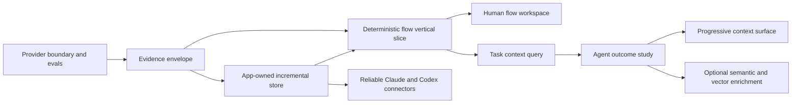

# Product backlog

> [Documentation hub](README.md) · [SDLC](../README.md)

This is the canonical home for **unfinished work only**, ordered by expected
leverage. Each item carries enough context to evaluate and start it without
opening a separate proposal. It is an outcome backlog, not a commitment to a
particular sprint length. Prioritized from the 2026-08-05 audit and the
2026-08-13 strategic review recorded in [DECISIONS.md](DECISIONS.md).

Looking for something else?

- What the implementation does today → [current-state audit](CURRENT_STATE_AUDIT.md)
- What already shipped → [changelog](CHANGELOG.md)
- Why an approach was chosen → [decisions](DECISIONS.md)
- Rules that gate a code change → [`../CONVENTIONS.md`](../CONVENTIONS.md)

**When a criterion is met:** move it to [`CHANGELOG.md`](CHANGELOG.md) as a dated
outcome in the same change, and record an entry in [`DECISIONS.md`](DECISIONS.md)
if architecture or compatibility moved. **When the last criterion is met:** remove
the item from this file rather than marking it complete. Nothing here should
describe finished work — that is what made this file twice its necessary length.

## Ordering rationale

The next phase should make one end-to-end path trustworthy before broadening language coverage, adding more MCP tools, or committing to vector infrastructure. The outcome study sits between the task query and everything that would grow it — expand, feedback, and vectors are built on measured need, not anticipated need. The dependency order is:

## P0 — foundations that prevent rework

### PROV-001: Provider runner and SCIP import spike

Implement the boundary described in
[`PROVIDER_STRATEGY.md`](PROVIDER_STRATEGY.md) before extending the current
TypeScript semantic prototype.

Acceptance criteria:

- Providers declare identity, version, supported capabilities, required inputs,
  and degradation behavior.
- One maintained SCIP indexer can be invoked against an immutable, app-owned
  staged snapshot of this repository. A prebuilt index may also be imported for
  evaluation, but is unverified unless it comes with equivalent provenance.
- The runner records provider identity and version, output digest, and an input
  manifest for the staged snapshot. Only output produced from that immutable
  view, or from equivalently mutation-fenced inputs, can be classified as exact
  for that snapshot; equal live-workspace signatures before and after a run are
  not sufficient.
- A mismatched working tree is reported as stale rather than exact. An arbitrary
  imported index is reported as unverified, not assigned the snapshot observed
  at import time.
- Provider artifacts are written to app-owned or temporary workspace storage,
  not into the indexed source repository.
- Tree-sitter syntax/search remains available when the precise provider is
  absent or fails.
- EVAL-001 compares the provider with the existing reference prototype before
  either is promoted as the product default.
- The implementation does not duplicate TypeScript project or package
  resolution inside SDLC.

Shipped so far → [CHANGELOG 2026-08-10](CHANGELOG.md#2026-08-10). Remaining criteria above.

### INT-001: Canonical fact, edge, and provenance contract

Define the common intermediate representation before adding deeper analyzers.

This is a provider-neutral interchange envelope, not a new semantic indexer or
a duplicate compiler dependency graph. Keep it no larger than required to
preserve provider identity, evidence, uncertainty, snapshot, and staleness at
the app boundary.

Required fields include stable identity, workspace, producer, producer version, source anchor, confidence or certainty class, generation, ownership scope, input signature, and timestamps. Define an initial vocabulary for containment, import, reference, call, return, branch, throw/catch, await/resume, register/dispatch, read/write, emit/handle, and terminal-effect relations.

Acceptance criteria:

- Parsed, compiler-resolved, framework-inferred, runtime-observed, human-authored, and LLM-derived facts are distinguishable in storage and query responses.
- Every returned edge can navigate to evidence or state why direct source evidence is unavailable.
- Unknown and ambiguous relations have explicit representations.
- Versioned schema documentation includes compatibility and migration rules.
- Existing symbols/imports/refs and asserted relations can be projected into the contract.

Shipped so far → [CHANGELOG 2026-08-10](CHANGELOG.md#2026-08-10). Remaining criteria above.

### EVAL-001: Golden corpus and measurement harness

Create small checked-in repositories or fixtures that exercise direct calls, aliases, overloads, callbacks, conditions, exceptions, async work, HTTP registration, events, database effects, and unresolved dynamic behavior. Include expected symbols, relations, entry points, paths, and uncertainty.

Acceptance criteria:

- One command reports symbol/reference/path precision and recall, indexing time, incremental time, peak memory, and store size.
- Retrieval scenarios report recall at K, evidence coverage, packed tokens, and irrelevant-context rate.
- Every selected syntax, compiler, and external provider is compared against
  the same provider-neutral oracle.
- Results are machine-readable and CI fails on agreed correctness regressions.
- Benchmarks clearly separate cold, warm, and one-file-change runs.

Shipped so far → [CHANGELOG 2026-08-11](CHANGELOG.md#2026-08-11). Remaining criteria above.

Shipped so far → [CHANGELOG 2026-08-12](CHANGELOG.md#2026-08-12). Remaining criteria above.

### STORE-001: Move workspace state under app ownership

Replace in-repository, whole-export `sql.js` persistence with a native SQLite owner behind the local engine. Define workspace IDs, store locations, migrations, backups, corruption recovery, and repository relocation behavior.

Acceptance criteria:

- Indexing does not write generated state into the source repository.
- Transactions update changed facts without exporting the entire database.
- A workspace can move or be re-opened without silently duplicating or losing knowledge.
- The daemon handles schema migration and failed migration recovery.
- FTS5 is enabled and queried through an internal search interface.
- Existing prototype stores have either a tested migration or a clearly documented disposable reset path.

Shipped so far → [CHANGELOG 2026-08-12](CHANGELOG.md#2026-08-12). Remaining criteria above.

### INCR-001: Ownership and dependency-directed invalidation

Implement a signature hierarchy and a dependency table for derived artifacts.

Acceptance criteria:

- File, syntax, symbol-interface, symbol-body, relation-set, flow, component, prompt/model, and semantic-result signatures can be recorded where applicable.
- A comment-only change does not automatically invalidate unrelated semantic and flow artifacts.
- A public symbol change invalidates known callers and dependent summaries.
- The application can explain why an item is fresh or stale.
- Deleted, renamed, and moved files do not leave orphan facts.
- Full scans and watch refreshes share an explicit, tested Rust
  source-inclusion policy. Generated builds, packaged app copies, and app-owned
  artifacts cannot enter trusted facts through either path, and the UI
  can explain why a path was included or excluded.

Observed during the 2026-08-06 desktop walkthrough: creating the packaged app
under `release/` caused its bundled `preload.cjs` to enter the live inventory and
immediately appear as an unexplained, drifting map file. Resolve this as an
input-boundary rule, not as a one-off special case for this repository.

Shipped so far → [CHANGELOG 2026-08-12](CHANGELOG.md#2026-08-12). Remaining criteria above.

Schema v24 adds comment-invariant `syntax_sha` per file, `interface_sha` and
`body_sha` per symbol, a stable `symbol_key` that survives cosmetic edits, a
`relation_set_sha`, an `artifact_dependencies` table and a `file_moves` audit
trail. `EXTRACTION_VERSION` 19 promotes one full rescan, since a migration
cannot fill parser-produced columns. Components, flow steps, relations, memory
anchors, explorations and execution entries now compare meaning; findings and
source slices deliberately keep comparing content, because a comment really does
move a line range. A moved contract invalidates the *summaries* written against
it through recorded interface dependencies, computed at read time — it does not
re-parse callers, whose own facts would rebuild identically. Renames correlate
only on a Git rename or an exact content match with a one-to-one pairing, and
authored knowledge follows; anything ambiguous degrades as before. Knowledge
left pointing at deleted code is neither dropped nor left invisible: it is
reported as a distinct `orphan-anchor` gap covering memories, assertions and
flow steps, separate from a note recorded against a file that merely changed. The evaluation harness's existing comment-append probe now reports
`filesReparsed: 1, filesMeaningChanged: 0, executionEntriesStale: 0`. Parse time
rose from 100.0 ms to 111.0 ms on this repository.

A review pass then closed seventeen correctness gaps in that model. The syntax
signature hashes node kinds and boundaries, not only leaves, because a leaf
stream cannot tell a Python statement moved out of a block from one left inside
it. An interface, enum or class body counts as contract rather than
implementation. Export visibility is folded into the interface signature, since
`export function f` and `function f` produce identical declaration nodes.
Comments that are instructions — `@ts-nocheck`, triple-slash references,
`@__PURE__`, bundler and linter directives — are hashed while prose is not.
Method keys are scoped to their enclosing declaration. `brief` and the asserted
overlay compare meaning too, so no two readers disagree about the same
artifact. Findings move with a renamed file and are re-keyed by the next
analyzer run — following the whole rename chain, since a file can move more
than once before an analyzer sees it — instead of being closed as fixed by a
scan that ran none. The
size cap is enforced before the read, a relaxed gitignore policy is shared with
the watcher, a malformed one is reported rather than discarded, truncated
component dependencies report as partial, and Git renames are read from
NUL-delimited porcelain so quoted paths still match the inventory.

Shipped so far → [CHANGELOG 2026-08-13](CHANGELOG.md#2026-08-13). Remaining criteria above.

Edge and reference re-resolution is no longer a whole-table pass. It is scoped
to the files a run re-parsed whenever the resolver's inputs — the set of indexed
paths and the alias table — are byte-identical to the ones in force when the
stored destinations were written; anything else falls back to the full pass,
because resolution is not monotone in the inventory and adding one file can
retarget an already-resolved edge. `relation_set_sha` finally has a reader:
where a re-parsed file's sorted specifier set is unchanged, its prior answers
are restored rather than recomputed. A gated run and a `full: true` run are
tested to agree after a scripted sequence of adds, deletes, renames and alias
changes.

A Python docstring is now prose, so editing one no longer drifts every artifact
anchored to its file — including through a class, whose whole body is its
contract. Doctests stay hashed, because `pytest --doctest-modules` runs them.
A finding whose file left the index because a rule started excluding it is
`retired` rather than `fixed`: a scan runs no analyzers, so nobody checked it.

Open: prompt, model and semantic-result signatures have storage but no producer
— that belongs to SEM-001. `refreshReferenceIdentity` still runs unscoped; its
correct scope is the re-parsed files plus every file that is the destination of
a reference, which is a larger analysis than the resolution gate. The Windows
freshness key is weaker than the Unix one, having neither a `ctime` with the
Unix meaning nor a stable file index, and leans on sampling to make up the
difference.

## P1 — first differentiated product slice

### FLOW-001: TypeScript entry-to-effect flow MVP

Dogfood the engine on this repository. Recognize daemon HTTP routes and CLI/MCP handlers as entries, then trace calls and branches to responses, database mutations, process execution, filesystem operations, and outbound requests as terminal effects.

This is a progressive static analysis, not a claim of complete path feasibility.
Evaluate Joern/CPG output against EVAL-001 first, then add only the translation
and product-specific framework adapters needed for the vertical slice. Do not
build a universal TypeScript control/data-flow engine or rely on undocumented
TypeScript compiler internals as the only representation.

Acceptance criteria:

- At least three real flows in this repository can be queried from a named entry to all recognized terminal effects.
- `if`/switch/loop, early return, throw/catch, and `await` transitions are visible and labeled.
- Each node/edge includes evidence and provenance; unresolved dispatch is shown as a gap.
- Cycles and recursion terminate safely and are represented without infinite expansion.
- Expected paths in the golden corpus pass precision/recall thresholds set by EVAL-001.
- Asserted relations can be enabled as a clearly labeled overlay in path queries.

Shipped so far → [CHANGELOG 2026-08-12](CHANGELOG.md#2026-08-12). Remaining criteria above.

### UI-001: Question-centered code and flow workspace

Turn the desktop from an operational viewer into a daily-use exploration surface.

Acceptance criteria:

- A global search box finds paths, symbols, exact text, components, flows, findings, and memories.
- Selecting a result opens source at the relevant range with definition/reference and caller/callee navigation.
- A user can choose an entry point, inspect alternate branches and terminal effects, and see provenance, uncertainty, and freshness without reading raw JSON.
- Source, path, and neighborhood views synchronize selections.
- Large graphs default to focused neighborhoods and expansion, not an unreadable whole-repository canvas.
- The workflow remains fully useful with semantic enrichment disabled.

Shipped so far → [CHANGELOG 2026-08-12](CHANGELOG.md#2026-08-12). Remaining criteria above.

### QUERY-001: One budgeted task-context query

Add an internal query planner and expose one primary agent operation such as `get_task_context`. It should compose lexical search, graph neighborhoods, flow paths, source ranges, tests, changes, findings, and approved memories.

Acceptance criteria:

- Inputs include the task, optional known targets, intent, a token/byte
  budget, and optional failure evidence — failing-test output, a stack trace,
  an error string — which seeds ranking the way working-tree changes already
  do. At least one retrieval scenario exercises each seed kind.
- Results contain a ranked evidence package, omissions, uncertainty, freshness, and recommended follow-up reads.
- The response carries an explicit sufficiency verdict — target exact, minimal
  context sufficient; cross-file context required; low confidence, explore;
  stale evidence, reindex first; exact-text search recommended — and the
  retrieval corpus scores the verdict, because a wrong "sufficient" is how a
  brief does harm.
- Every excerpt or conclusion has a navigable source/fact reference.
- It beats the pinned Aider-map baseline on the retrieval corpus and clears
  the EVAL-002 Phase 1 gate: at least five points more task success than the
  stock arm, or non-inferior success at twenty-five percent fewer tokens or
  tool calls — and no worse than the Aider-map arm on task success within a
  predeclared token-cost band. Every margin is predeclared in
  [EVALUATION.md](EVALUATION.md) before the pilot runs, and a margin counts as
  cleared only at its predeclared confidence bound — a point estimate alone
  promotes nothing. Until all of that holds it remains an experimental
  internal path; when it does, the label is replaced by an evaluation status
  scoped to the repositories, task classes, and languages the pilot measured,
  and unmeasured domains stay labeled unverified.
- After EVAL-002 proves the query, the public MCP catalog is reviewed against
  a named target shape — brief, expand, read_file, search, and the
  knowledge-authoring tools as the primary tier — and tools that tier composes
  internally are demoted or retired.

Shipped so far → [CHANGELOG 2026-08-12](CHANGELOG.md#2026-08-12). Remaining criteria above.

### EVAL-002: Agent task-outcome study

The retrieval corpus measures what a brief contains, not what an agent does
with one. Its recall is capped by the evidence budget, its evidence matching
cannot credit the baseline for memories, and downstream task success is
measured nowhere. Before the query surface grows — expand, feedback, vectors —
run a study sized for one developer that measures whether briefs change task
outcomes. Tasks are scoped to capabilities the current-state audit marks
measured, so a negative result indicts the thesis rather than unfinished
implementation.

Acceptance criteria (Phase 1, the pilot):

- 20–30 held-out tasks across two or three TypeScript repositories, each with
  a per-task verification command, run under one pinned harness, model, and
  prompt set, with multiple trials per task and arm. The verifier and its
  tests live outside the writable checkout, and a trial that edited verifier
  files is rejected before scoring — an agent must not be able to make the
  oracle pass by editing it.
- Every trial starts from the same immutable commit in a fresh disposable
  checkout with freshly installed or verified byte-identical dependencies, and
  a fresh or byte-identical isolated store and session — a per-trial
  `SDLC_HOME` — with arm order randomized or counterbalanced. A reused
  checkout contaminates later arms through untracked, ignored, and
  `node_modules` state even when the commit matches.
- The decision rule — success aggregation across trials, the non-inferiority
  margin, the brief-harm ceiling, the regression bound for exact-string and
  small-target tasks, the Aider token-cost band and success margin, and the
  uncertainty test (paired or task-clustered, with the confidence bound each
  margin must clear) — is predeclared in [EVALUATION.md](EVALUATION.md)
  before the first pilot run.
- Four arms: a stock agent; the agent plus the pinned Aider map; the agent
  plus `brief` with ordinary tools retained; the agent restricted to
  brief-supplied context with source reads forbidden. The last arm exists to
  falsify context-only, not to promote it.
- The primary metric is task success. Diagnostics include tokens, tool calls,
  wall time, brief harm, and search-escape rate (the hybrid arm abandons the
  brief for raw search), taken from harness transcripts rather than
  self-report. Brief harm is task-level net discordance — stock-beats-hybrid
  minus hybrid-beats-stock, with clustered uncertainty — not raw discordant
  pairs, which stochastic trials produce even between identical arms.
- Results are machine-readable; unmeasured cells are labeled gaps, not zeros.

Phase 2 begins only after Phase 1 reports: more repositories and languages,
ablations (no graph, no git, no tests, no memories, no flows), and optionally
a Serena comparator arm — instrumented from harness transcripts like every
other arm, since QUERY-002's feedback records only cover SDLC's own surfaces.
QUERY-001's promotion gate consumes these results.

### SEARCH-001: Lexical, structural, and graph-ranked retrieval

Build a strong non-vector baseline using FTS5, identifier-aware scoring, path and language filters, current structural search, and graph centrality/proximity.

Acceptance criteria:

- Exact identifiers, filenames, error strings, phrases, prefixes, and natural-language descriptions have tests.
- Ranking explains whether a result came from lexical match, graph proximity, flow membership, change relevance, or memory.
- Search refresh is incremental.
- Saved queries can be re-run against later index generations for desktop insights.

Shipped so far → [CHANGELOG 2026-08-12](CHANGELOG.md#2026-08-12). Remaining criteria above.

### CONN-001: Idempotent Claude and Codex connector manager

Introduce a connector interface with plan, apply, verify, repair, update, and remove operations. Package a Codex companion plugin in addition to the existing Claude plugin.

Acceptance criteria:

- The app detects compatible Claude/Codex CLI and desktop surfaces separately.
- It displays exact proposed changes and requires appropriate consent.
- It uses supported marketplace/plugin/MCP commands or APIs where available instead of blind config splicing.
- Installation includes the companion plugin/skills/commands and MCP connection, not MCP alone.
- Verification performs discovery plus a local engine health/tool call.
- Re-running is idempotent; repair and uninstall only change app-owned entries.
- Compatibility failures provide an actionable diagnosis and never leave a half-configured integration without rollback guidance.

## P2 — compound the value

### SEM-001: Evidence-backed semantic components and workflows

Generate component responsibilities, domain concepts, and human-readable workflows from deterministic subgraphs. Store prompts, model/version, inputs, outputs, evidence links, and approval state.

Acceptance criteria:

- Semantic artifacts can be proposed, edited, approved, rejected, and regenerated selectively.
- A changed dependency marks the artifact stale without deleting the last approved version.
- The UI shows deterministic facts and semantic interpretation as separate layers.
- Generation is cached by normalized input/model/prompt signature and has a configurable local or remote provider policy.
- Interrupted generation remains explicitly partial, can resume without
  discarding valid work, and cannot be presented as a complete map until its
  coverage/finalization contract succeeds.

Shipped so far → [CHANGELOG 2026-08-06](CHANGELOG.md#2026-08-06). Remaining criteria above.

### MEM-001: Trustworthy project memory

Evolve notes into a knowledge workflow for gotchas, standards, preferences, decisions, and operational facts.

Acceptance criteria:

- Memories support authorship, evidence, anchors at symbol/range/component/flow level, status, supersession, and review dates.
- Users can create, edit, validate, reject, and resolve stale memories in the desktop app.
- Recall combines FTS, graph proximity, task intent, freshness, approval
  state, and recorded utilization: memories whose feedback marks them helpful
  rank up; stale or weakly anchored memories rank down rather than being
  served at full confidence.
- Each time a memory is served into a brief or recall, the service and any
  feedback on it are recorded, so unused and harmful memories are discoverable
  (feedback arrives via QUERY-002).
- Agent-created assertions never silently become approved team facts.

### QUERY-002: Progressive context surface and retrieval feedback

Only start after the EVAL-002 Phase 1 pilot reports; its brief-harm and
search-escape numbers decide what this surface must fix. The contract is
defined now so the pilot knows what it informs: `brief` opens, `expand`
deepens, `read_file` stays the authoritative final step, and a feedback
operation closes the loop.

Acceptance criteria:

- Every retrieval response — brief, expand, and recall — carries a stable
  retrieval id that read and feedback calls reference, with brief evidence
  items individually addressable beneath it; feedback on a recall result needs
  no prior brief to correlate against.
- `expand` deepens one named evidence item from a prior brief within a budget,
  without re-running the query.
- A feedback operation records, per evidence item, helpful, unhelpful,
  ignored, or misleading — consulted-but-rejected is unhelpful, not helpful —
  and whether the session escaped to raw search; EVAL-002 Phase 2 diagnostics
  and MEM-001 recall ranking consume those records.
- The surface ships only if the pilot shows briefs earning it; otherwise this
  item is re-argued in [DECISIONS.md](DECISIONS.md) rather than silently
  built.

### VEC-001: Evaluated optional semantic retrieval

Only start after SEARCH-001 and QUERY-001 establish baselines and the EVAL-002
Phase 1 pilot reports. Embed compact units such as symbol summaries, component descriptions, workflows, documentation, and memories rather than arbitrary fixed-size source chunks by default.

Acceptance criteria:

- Embeddings are derived, versioned, disposable, and excluded from the authoritative backup contract.
- Hybrid ranking has a documented fusion method and optional reranking.
- It materially improves named evaluation scenarios at an acceptable indexing-time, disk, latency, privacy, and token cost.
- The product works when the vector index or embedding model is unavailable.

### LANG-001: Provider architecture and precise-index imports

Define language capability manifests and add providers based on user demand. Prefer importing SCIP or compiler/language-server facts where reliable, with Tree-sitter syntax fallback.

Acceptance criteria:

- Each provider declares supported fact/edge types and precision levels.
- Mixed-language paths preserve producer and confidence at every boundary.
- Missing providers degrade to searchable syntax rather than making the workspace unusable.
- Provider failures are isolated and diagnosable from the desktop app.

### CHANGE-001: Knowledge diff and architectural insights

Retain selected generations so users can compare symbols, dependencies, flows, effects, and semantic maps across working-tree or commit changes.

Acceptance criteria:

- A user can answer “what behavior and dependencies changed?” rather than only “what lines changed?”
- Saved structural queries show count/history changes.
- Drift views link directly to source and affected derived knowledge.
- Retention and compaction are configurable and bounded.

### RUNTIME-001: Runtime evidence overlay

Import test coverage or opt-in traces to confirm dynamic dispatch and path execution. Runtime facts supplement static facts and never erase unobserved possibilities.

Acceptance criteria:

- Observed calls/effects include run identity, environment, test/request context, and time.
- The UI can distinguish possible, statically resolved, and observed paths.
- Instrumentation is opt-in, bounded, and documents performance and privacy impact.

## P3 — scale and ecosystem

- **XREPO-001:** cross-repository workspaces and version-aware dependency navigation.
- **SDK-001:** stable local query/enrichment SDK for language providers and third-party tools.
- **TEAM-001:** explicit export/import or synchronization of approved semantic knowledge without requiring source/index upload.
- **INSIGHT-001:** dashboards for architectural boundaries, dependency policy, ownership, risk, and longitudinal change.
- **SEC-001:** signed integration bundles, supply-chain policy, least-privilege connector permissions, and auditable local data/provider controls.

## Recommended first implementation sequence

### Slice 1: Trust the facts

Deliver the smallest useful EVAL-001 corpus, the narrow PROV-001 runner/SCIP
spike, and only the minimum INT-001 envelope needed to compare existing and
imported facts honestly. This makes subsequent work measurable without first
rebuilding a compiler indexer.

### Slice 2: Own the state

Deliver STORE-001 plus enough INCR-001 to move this repository’s index out of `sdlc-audit/` and update a single changed file transactionally. Add FTS5 and expose it behind the internal search interface.

### Slice 3: Prove a real flow

Deliver FLOW-001 for one daemon route all the way through the UI and MCP query. Use the golden corpus and this repository as dual fixtures. This is the first differentiated demonstration of the product vision.

### Slice 4: Make it a product

Deliver the focused portion of UI-001 needed to search, inspect, and correct that flow, then implement CONN-001 so both Claude and Codex can consume it through thin, supported integrations.

### Slice 5: Prove it helps

Run the EVAL-002 Phase 1 pilot against the existing experimental brief before
building expand, feedback, or vector retrieval. The pilot's brief-harm and
search-escape rates are the design input for QUERY-002, and its success delta
is the promotion gate for QUERY-001.

## Explicitly deferred

Until the recommended slices are measured and usable, defer:

- a standalone graph database;
- a production vector database or repository-wide embedding pass;
- autonomous memory promotion;
- many additional MCP tools;
- broad language count as a vanity metric;
- cloud collaboration infrastructure;
- Augment-style non-code knowledge — tickets, pull requests, CI history — as
  retrieval inputs;
- an auto-generated Aider-style repository map as a product capability — the
  pinned map stays an evaluation baseline only;
- full CodeQL/Joern-style data-flow and security-query breadth.

These may become valuable. Deferral protects the evidence model and core user workflow from being buried under infrastructure.

## Deferred checkpoint findings

These issues were reproduced during the architecture checkpoint review but do
not currently threaten stored knowledge, answer correctness, a supported
end-to-end workflow, or the local security boundary:

- Add bounded idle expiry for stateful HTTP MCP sessions. Normal bridge exit
  closes its stream without sending the optional session-termination request,
  so the daemon retains a small session object until restart.
- Collapse strongly connected call components, or otherwise prevent cycles
  from inflating presentation depth in the layered flow view. Traversal is
  already depth- and node-bounded; this is a layout-quality issue.
