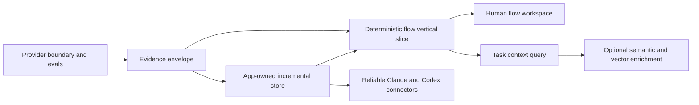

# Product backlog

Status: proposed and prioritized from the 2026-08-05 audit. This is an outcome backlog, not a commitment to a particular sprint length.

## Ordering rationale

The next phase should make one end-to-end path trustworthy before broadening language coverage, adding more MCP tools, or committing to vector infrastructure. The dependency order is:

## P0 — foundations that prevent rework

### PROV-001: Provider runner and SCIP import spike

Implement the boundary described in
[`PROVIDER_STRATEGY.md`](PROVIDER_STRATEGY.md) before extending the current
TypeScript semantic prototype.

Acceptance criteria:

- Providers declare identity, version, supported capabilities, required inputs,
  and degradation behavior.
- One maintained SCIP indexer can be invoked against an immutable, app-owned
  staged snapshot of this repository. A prebuilt index may also be imported for
  evaluation, but is unverified unless it comes with equivalent provenance.
- The runner records provider identity and version, output digest, and an input
  manifest for the staged snapshot. Only output produced from that immutable
  view, or from equivalently mutation-fenced inputs, can be classified as exact
  for that snapshot; equal live-workspace signatures before and after a run are
  not sufficient.
- A mismatched working tree is reported as stale rather than exact. An arbitrary
  imported index is reported as unverified, not assigned the snapshot observed
  at import time.
- Provider artifacts are written to app-owned or temporary workspace storage,
  not into the indexed source repository.
- Tree-sitter syntax/search remains available when the precise provider is
  absent or fails.
- EVAL-001 compares the provider with the existing reference prototype before
  either is promoted as the product default.
- The implementation does not duplicate TypeScript project or package
  resolution inside SDLC.

Progress (2026-08-10): the app now bundles the maintained SCIP TypeScript
indexer, supervises bounded evaluation runs, decodes and hashes indexes in Rust,
stores manifests outside source repositories, reports capabilities in the
desktop, and preserves Tree-sitter fallback behavior. Rust now copies the exact
indexed source generation into a private app-owned view, rejects a generation
mismatch, records every staged input and hash, verifies that view after the
provider exits, and reports retained output as stale after the source signature
changes. The app does not yet attest package dependencies or other compiler
reads outside that source view, so the evaluation remains partial/unverified
instead of claiming exact provenance. Official SCIP occurrences and
relationships now project through the provider-neutral evidence envelope with
artifact/input-manifest validation, workspace ownership, exact staged-root
binding, portable path confinement, retained case-alias identities, bounded
collection, conflict-safe local-symbol scope, and explicit ambiguity. Broader
golden-corpus comparison and complete dependency/read-closure attestation
remain acceptance-critical next steps. Joern
is detected but intentionally not bundled before its EVAL-001 spike. Configless
evaluation now uses an app-owned config rather than allowing the upstream CLI
to write `tsconfig.json` into the workspace, and Rust comparison aggregates
deduplicate documents emitted by overlapping project configs. Discovery,
execution, and decode waits are cancellable; requested projects that the
upstream tool skips are reported as `partial` rather than a fully successful
evaluation. Discovery covers both TypeScript and JavaScript configs, invalid
configs and oversized-source skips remain visible in partial results, and
flag-like but legal workspace paths cannot be interpreted as provider options.
Preflight is syntax-only, size/time bounded, and leaves solution-config project
references to SCIP instead of synchronously duplicating compiler resolution in
the daemon.

### INT-001: Canonical fact, edge, and provenance contract

Define the common intermediate representation before adding deeper analyzers.

This is a provider-neutral interchange envelope, not a new semantic indexer or
a duplicate compiler dependency graph. Keep it no larger than required to
preserve provider identity, evidence, uncertainty, snapshot, and staleness at
the app boundary.

Required fields include stable identity, workspace, producer, producer version, source anchor, confidence or certainty class, generation, ownership scope, input signature, and timestamps. Define an initial vocabulary for containment, import, reference, call, return, branch, throw/catch, await/resume, register/dispatch, read/write, emit/handle, and terminal-effect relations.

Acceptance criteria:

- Parsed, compiler-resolved, framework-inferred, runtime-observed, human-authored, and LLM-derived facts are distinguishable in storage and query responses.
- Every returned edge can navigate to evidence or state why direct source evidence is unavailable.
- Unknown and ambiguous relations have explicit representations.
- Versioned schema documentation includes compatibility and migration rules.
- Existing symbols/imports/refs and asserted relations can be projected into the contract.

Progress (2026-08-10): schema version 1 now defines the minimum producer,
generation, ownership, certainty, freshness, evidence, endpoint, node, and edge
envelope plus the initial relation vocabulary. The existing files, symbols,
imports, references, and authored relations project into it without replacing
their prototype tables; missing legacy import ranges and unresolved endpoints
remain explicit. Official SCIP occurrences and relationships now project
through the same envelope with durable workspace/run validation. Persisting
provider-run ownership and broader query adoption remain open.

### EVAL-001: Golden corpus and measurement harness

Create small checked-in repositories or fixtures that exercise direct calls, aliases, overloads, callbacks, conditions, exceptions, async work, HTTP registration, events, database effects, and unresolved dynamic behavior. Include expected symbols, relations, entry points, paths, and uncertainty.

Acceptance criteria:

- One command reports symbol/reference/path precision and recall, indexing time, incremental time, peak memory, and store size.
- Retrieval scenarios report recall at K, evidence coverage, packed tokens, and irrelevant-context rate.
- Every selected syntax, compiler, and external provider is compared against
  the same provider-neutral oracle.
- Results are machine-readable and CI fails on agreed correctness regressions.
- Benchmarks clearly separate cold, warm, and one-file-change runs.

Progress (2026-08-11): the first checked-in TypeScript fixture covers a
cross-file call, condition, early return, throw, await, and terminal HTTP
response. `npm run eval` now runs the native scanner, native scanner plus
TypeScript checker prototype, and SCIP provider in isolated workers; it emits
machine-readable targeted symbol/reference precision and recall, cold/warm/
one-file-change timing where supported, prototype-store/artifact size, worker
peak RSS, missing facts, and threshold failures. CI pins the official SCIP
v0.9.0 binary and reuses its golden-test format and validator rather than
reimplementing occurrence truth. Path and retrieval scoring, external-provider
child memory, broader fixtures, and meaningful promotion thresholds remain
open. See
[`EVALUATION.md`](EVALUATION.md).

Progress (2026-08-11, Python slice): oracle schema version 2 now declares
languages and applicable providers, enforces matching per-provider thresholds,
and can hold reviewed entrypoint/relation/path truth without pretending it is
already scored. A small Agent Arena-inspired LangGraph fixture records one
manifest entrypoint, thirteen framework/effect relations, and four expected paths.
The native scanner measures 9/9 selected symbols and 8/9 references;
evaluation-only SCIP-Python 0.6.6 measures 9/9 for both and passes upstream
`scip test`, but emits no flow relationships.

Progress (2026-08-11, Joern slice): an opt-in, digest-pinned, network-disabled
Joern container evaluation now consumes the official Python CPG and official
GraphSON export. A narrow LangGraph adapter scores 12/13 relations at 1.0
precision/0.923077 recall and 3/4 exact relation-sequence paths at 1.0
precision/0.75 recall. The missing relation/path is deliberately the
human-asserted result-store boundary. The 2.17 GB extracted AMD64-only slim
image and full-GraphSON translation fail packaging criteria, so Joern remains
evaluation-only rather than becoming a bundled provider. Broader flow fixtures,
condition/feasibility scoring, external child memory, unified corpus execution,
and broader provider coverage remain open acceptance criteria.

Progress (2026-08-12, retrieval slice): the ordinary evaluation command now
runs two task-context scenarios against a digest-pinned artifact generated by
real Aider 0.86.2 output. A strict checked-in oracle measures recall at K,
reviewed evidence coverage, irrelevant-path rate, complete response bytes, and
exact `o200k_base` tokens without installing Aider in normal CI or
reimplementing its ranking. Both sides stay inside a shared 1,600-token band.
The idempotency scenario beats the map on recall, reviewed evidence coverage,
and noise; the review scenario now retrieves its checkout, inventory, and test
evidence while also beating the map on recall and noise. Both responses use
less than 1.5 times the map's actual tokens. A third generic review scenario
now mutates one file after a clean fixture commit and measures exact change
detection plus graph expansion without giving the query a filename or symbol.
It reaches 1.0 recall and coverage with zero irrelevant paths. Tightened
regression floors pass, but promotion remains explicitly blocked on a broader
corpus and downstream task outcomes.

### STORE-001: Move workspace state under app ownership

Replace in-repository, whole-export `sql.js` persistence with a native SQLite owner behind the local engine. Define workspace IDs, store locations, migrations, backups, corruption recovery, and repository relocation behavior.

Acceptance criteria:

- Indexing does not write generated state into the source repository.
- Transactions update changed facts without exporting the entire database.
- A workspace can move or be re-opened without silently duplicating or losing knowledge.
- The daemon handles schema migration and failed migration recovery.
- FTS5 is enabled and queried through an internal search interface.
- Existing prototype stores have either a tested migration or a clearly documented disposable reset path.

Progress (2026-08-12, native-storage foundation): the engine now owns a
bundled `rusqlite` connection inside the existing Rust N-API module. Stores are
written directly under `~/.sdlc/stores/<workspace-id>/audit.db` (or
`SDLC_HOME`), use WAL transactions, and no longer export an in-memory
`sql.js` image. Opening a repository with a prototype
`sdlc-audit/audit.db` copies it into app-owned storage and retains the original
as a recoverable backup; migration and restart behavior are covered by tests.
That foundation left stable identity across repository relocation,
versioned/rollback-safe schema migrations and corruption recovery, and an FTS5
schema exposed through the internal retrieval interface. Bundled SQLite's FTS5
capability was verified, but capability alone did not satisfy the search
acceptance criterion.

Progress (2026-08-12, migration-recovery slice): schema v17 establishes
SQLite `user_version` as the compatibility gate and records an ordered
`schema_migrations` ledger. The Rust storage owner runs `quick_check` before
and after migration, rejects newer or conflicting schema versions before
enabling WAL, creates an atomic online backup that includes committed WAL
pages, normalizes it into one standalone database, and applies every schema
step in one immediate transaction. A tested failure rolls back both DDL and
version metadata while retaining the validated pre-migration image; retries
keep only the newest image for that target version rather than accumulating
full copies. The legacy v1-v16 shapes converge through a frozen v17 bootstrap;
future versions require immutable ordered Rust migration cases. General
corruption repair still needs an explicit, user-visible restore workflow
rather than a silent automatic rollback that could discard newer knowledge.
Stable identity across repository relocation and the internal FTS5 retrieval
surface also remain open.

Progress (2026-08-12, FTS retrieval slice): schema v18 now uses SQLite's
external-content FTS5 tables, Unicode tokenizer, prefix indexes, BM25 ranking,
and snippets as a derived access path over relational facts and authored
knowledge. SQLite triggers maintain searchable files, symbols, memories,
findings, components, flows, and asserted relations in the same transaction as
their authoritative rows, including lifecycle changes and child anchors. One
bounded Rust query parser prevents callers from injecting raw FTS syntax. The
existing memory recall, cross-repository search, HTTP search endpoint, and a new
desktop global-search workspace share that interface; no new MCP tool was
added. STORE-001 still needs stable identity across repository relocation and
an explicit user-visible general-corruption restore workflow.

### INCR-001: Ownership and dependency-directed invalidation

Implement a signature hierarchy and a dependency table for derived artifacts.

Acceptance criteria:

- File, syntax, symbol-interface, symbol-body, relation-set, flow, component, prompt/model, and semantic-result signatures can be recorded where applicable.
- A comment-only change does not automatically invalidate unrelated semantic and flow artifacts.
- A public symbol change invalidates known callers and dependent summaries.
- The application can explain why an item is fresh or stale.
- Deleted, renamed, and moved files do not leave orphan facts.
- Full scans and watch refreshes share an explicit, tested Rust
  source-inclusion policy. Generated builds, packaged app copies, and app-owned
  artifacts cannot enter trusted facts through either path, and the UI
  can explain why a path was included or excluded.

Observed during the 2026-08-06 desktop walkthrough: creating the packaged app
under `release/` caused its bundled `preload.cjs` to enter the live inventory and
immediately appear as an unexplained, drifting map file. Resolve this as an
input-boundary rule, not as a one-off special case for this repository.

Progress (2026-08-12, input boundary and signature hierarchy): one Rust
`input_policy` module now owns a single inclusion decision that returns a typed
reason, and both the scan walk and the watcher ask it, so the two cannot drift.
An explicit `EntryKind` settles the hidden-segment rule the previous pair of
functions disagreed on. The generated-output rule consults the repository's own
committed `.gitignore` and only that; `.ignore`, the global gitignore,
`$GIT_DIR/info/exclude` and parent directories stay excluded because determinism
across clones is what the earlier rule was protecting. Packaged-bundle and
app-owned-storage rules hold where a repository has no `.gitignore`. Schema v23
records the decisions the walk actually made — a pruned directory once, never
its interior — with true per-reason totals beside a bounded sample, surfaced in
the existing overview and in a file-view error that names the rule. A catch-all
`.gitignore` relaxes once with a diagnostic rather than reporting an empty
repository. Measured on this repository: of the files that survived the previous policy,
`git check-ignore` returns exactly four — the packaged-application paths under
`release/`, including the desktop app's own bundled `preload.cjs` — and nothing
else. The whole directory is now one recorded decision rather than four.

Schema v24 adds comment-invariant `syntax_sha` per file, `interface_sha` and
`body_sha` per symbol, a stable `symbol_key` that survives cosmetic edits, a
`relation_set_sha`, an `artifact_dependencies` table and a `file_moves` audit
trail. `EXTRACTION_VERSION` 19 promotes one full rescan, since a migration
cannot fill parser-produced columns. Components, flow steps, relations, memory
anchors, explorations and execution entries now compare meaning; findings and
source slices deliberately keep comparing content, because a comment really does
move a line range. A moved contract invalidates the *summaries* written against
it through recorded interface dependencies, computed at read time — it does not
re-parse callers, whose own facts would rebuild identically. Renames correlate
only on a Git rename or an exact content match with a one-to-one pairing, and
authored knowledge follows; anything ambiguous degrades as before, and
`orphanedOverlays` lists what still points at deleted code instead of dropping
it. The evaluation harness's existing comment-append probe now reports
`filesReparsed: 1, filesMeaningChanged: 0, executionEntriesStale: 0`. Parse time
rose from 100.0 ms to 111.0 ms on this repository.

A review pass then closed seventeen correctness gaps in that model. The syntax
signature hashes node kinds and boundaries, not only leaves, because a leaf
stream cannot tell a Python statement moved out of a block from one left inside
it. An interface, enum or class body counts as contract rather than
implementation. Export visibility is folded into the interface signature, since
`export function f` and `function f` produce identical declaration nodes.
Comments that are instructions — `@ts-nocheck`, triple-slash references,
`@__PURE__`, bundler and linter directives — are hashed while prose is not.
Method keys are scoped to their enclosing declaration. `brief` and the asserted
overlay compare meaning too, so no two readers disagree about the same
artifact. Findings move with a renamed file and are re-keyed by the next
analyzer run instead of being closed as fixed by a scan that ran none. The
size cap is enforced before the read, a relaxed gitignore policy is shared with
the watcher, a malformed one is reported rather than discarded, truncated
component dependencies report as partial, and Git renames are read from
NUL-delimited porcelain so quoted paths still match the inventory.

Open: a Python docstring is a string expression, not a comment, so editing one
still moves the syntax signature. The relation-set signature is recorded but not
yet used to skip whole-repository edge re-resolution. Prompt, model and
semantic-result signatures have storage but no producer — that belongs to
SEM-001. Repository walking is still not incremental: every scan re-reads and
re-hashes every file. Findings on paths a new rule excludes are still closed as
`fixed` rather than retired, which this change makes visible.

## P1 — first differentiated product slice

### FLOW-001: TypeScript entry-to-effect flow MVP

Dogfood the engine on this repository. Recognize daemon HTTP routes and CLI/MCP handlers as entries, then trace calls and branches to responses, database mutations, process execution, filesystem operations, and outbound requests as terminal effects.

This is a progressive static analysis, not a claim of complete path feasibility.
Evaluate Joern/CPG output against EVAL-001 first, then add only the translation
and product-specific framework adapters needed for the vertical slice. Do not
build a universal TypeScript control/data-flow engine or rely on undocumented
TypeScript compiler internals as the only representation.

Acceptance criteria:

- At least three real flows in this repository can be queried from a named entry to all recognized terminal effects.
- `if`/switch/loop, early return, throw/catch, and `await` transitions are visible and labeled.
- Each node/edge includes evidence and provenance; unresolved dispatch is shown as a gap.
- Cycles and recursion terminate safely and are represented without infinite expansion.
- Expected paths in the golden corpus pass precision/recall thresholds set by EVAL-001.
- Asserted relations can be enabled as a clearly labeled overlay in path queries.

Progress (2026-08-12, HTTP vertical slice): a bounded Rust Tree-sitter
framework adapter now recognizes explicit TypeScript/JavaScript HTTP route
guards and persists file-owned execution entries, operations, control edges,
diagnostics, producer identity, certainty, source evidence, and input hashes in
schema v19, with exact call-target occurrences added in schema v20. Schema v21
anchors finding ranges to the source revision that produced them. It retains
bounded positive boolean route alternatives, `if` branches, caught explicit
throws, `finally` transitions before deferred returns/throws, awaited calls,
returns/throws, and recognized HTTP response effects. Conditional operations
inside expressions, class-definition execution, loops, and switches remain
explicit gaps; input truncation remains diagnostic. Native path
enumeration is cycle- and budget-bounded. Reference refresh resolves aliased and
default imports, incorporates later compiler targets, and removes those targets
when their compiler generation becomes stale. Normalized method alternatives
cannot collide in storage, calls in nested conditions are retained, and deferred
callback bodies are not treated as executed. The existing MCP `flow` operation
prefers this model when it is
available, while preserving the older call graph as `mode: calls`, and the
desktop now presents entry-to-effect paths as its primary Flow workspace. A
checked-in HTTP fixture measures one entry, eight unique semantic relations,
nine distinct evidence occurrences, and three paths at 1.0 precision/recall;
an explicitly required measured provider now fails instead of passing
unmeasured when its adapter produces no graph. The real `GET /api/search` route
in this repository produces the same three response paths with resolved imported
targets. A repository dogfood scan currently recognizes 12 non-fixture daemon
HTTP entries. A checked-in regression now scans the actual repository and locks
the exact branches and recognized response effects for `GET /api/search`,
`ANY /api/watch`, and `POST /api/workspaces`, including the workspace route's
early returns. This closes the three-real-flow and early-return dogfood gaps,
but only the standalone `GET /api/search` fixture is scored through the
provider-neutral EVAL-001 precision/recall report. Switches, loops, uncaught
exceptions, interprocedural non-response effects, and broader formal path
evaluation remain outside that scored oracle. Query-level regressions now cover
explicit returns, uncaught throws, loops, and switches end to end. Execution-flow
schema v4 gives every path a typed terminal outcome, preserves the legacy
effect-only field, and presents loop/switch handling as incomplete gaps rather
than fabricated expansion. It also keeps resolved, unresolved, external, and
not-applicable target states distinct; unresolved calls count as source-anchored
gaps and keep traversing paths incomplete. Actual switch-case and loop-iteration
expansion remains open pending provider evaluation. Current authored
relations can be requested through the native query, HTTP API, and MCP `flow`
operation and displayed with the desktop's opt-in Asserted overlay. The overlay
remains separate from deterministic paths, excludes stale evidence, and cannot
change path certainty or completeness.

### UI-001: Question-centered code and flow workspace

Turn the desktop from an operational viewer into a daily-use exploration surface.

Acceptance criteria:

- A global search box finds paths, symbols, exact text, components, flows, findings, and memories.
- Selecting a result opens source at the relevant range with definition/reference and caller/callee navigation.
- A user can choose an entry point, inspect alternate branches and terminal effects, and see provenance, uncertainty, and freshness without reading raw JSON.
- Source, path, and neighborhood views synchronize selections.
- Large graphs default to focused neighborhoods and expansion, not an unreadable whole-repository canvas.
- The workflow remains fully useful with semantic enrichment disabled.

Progress (2026-08-12): the desktop now has a first global search workspace over
the shared FTS5 index and can open file-backed results in the existing indexed
file drawer. The first flow-centered entry-to-effect workspace is available for
supported deterministic entries. Flow steps, call-graph nodes, symbols,
findings, entries, and resolved call targets now open bounded source slices at
their indexed ranges. The desktop compares current source signatures with each
selected evidence generation, visibly marks stale or unattested evidence,
keeps the selected flow step synchronized with its source preview, and pages
through source without exposing an unbounded file response. Historical finding
ranges and authored flow assertions retain their producing source revision;
live external-tool findings without an attested snapshot remain unverified.
Resolved execution targets carry their exact declaration range from the Rust
reference index rather than relying on a same-named-symbol guess; ambiguous
authored symbol names require an explicit range selection instead of guessing.
Exact source-text indexing, richer definition/reference and caller/callee
navigation, graph-canvas selection synchronization, and multi-view selection
persistence remain open.

### QUERY-001: One budgeted task-context query

Add an internal query planner and expose one primary agent operation such as `get_task_context`. It should compose lexical search, graph neighborhoods, flow paths, source ranges, tests, changes, findings, and approved memories.

Acceptance criteria:

- Inputs include the task, optional known targets, intent, and a token/byte budget.
- Results contain a ranked evidence package, omissions, uncertainty, freshness, and recommended follow-up reads.
- Every excerpt or conclusion has a navigable source/fact reference.
- It beats an Aider-style symbol-map baseline on agreed EVAL-001 scenarios or remains an experimental internal path.
- The public MCP catalog is reviewed for redundant tools after this query is proven.

Progress (2026-08-12, experimental task-context slice): the existing `brief`
operation now accepts a task, optional targets, intent, and an exact UTF-8 byte
budget; no 34th MCP tool was added. A Rust planner beside the native SQLite
owner resolves targets without guessing, combines the shared FTS5 index with
bounded one-hop reference/import, execution-flow, authored-flow, finding,
memory, relation, exported-surface, and test evidence, and emits deterministic
scores with reasons and provenance. The thin TypeScript boundary reads only
planner-selected source ranges through the existing contained reader, compares
them with their producing signatures, and packs the complete pretty-printed
response to the requested byte ceiling. The former TypeScript-only brief
ranking implementation was removed, while its single-target call remains
compatible. Focused tests cover task-only and legacy MCP calls, the unchanged
33-tool catalog, ambiguity, stale evidence, source/fact navigation, and exact
budget accounting. This path reports itself as experimental: broader corpus
coverage and task outcomes remain open before QUERY-001 can be called proven
or redundant public tools can be retired.

Progress (2026-08-12, measured retrieval ranking): QUERY-001 now retrieves all
reviewed evidence in both first-corpus tasks. Review recall@5 is 0.5 with the
checkout declaration, inventory declaration, and covering test; debug recall@4
is 0.75 with the authored constraint and ledger declaration. Both have zero
irrelevant returned paths and use less than 1.5 times the map's actual tokens.
The Rust ranker removes the selected intent from lexical subject terms, rewards
independent corroborating signals, and applies a bounded repeated-path penalty.
The thin source boundary reserves useful space per admitted fact and no longer
duplicates ranking/provenance prose in its excerpt view. Tightened regression
floors preserve the result.

Progress (2026-08-12, change-aware retrieval): a bounded async Rust adapter now
consumes Git's stable porcelain v2 status instead of implementing a diff engine.
It distinguishes clean, non-repository, and unavailable states, resolves nested
workspace roots, rejects escaping/non-UTF-8 paths, and bounds Git status to 30
seconds, 2 MiB, and 256 normalized changes. It also clears inherited repository
selectors and merges multiple porcelain records for one path without discarding
staged state. The task planner preserves explicit targets ahead of unrelated
dirty files, prioritizes indexed changes before its 24-path graph-expansion cap,
and treats pre-refresh deletes and renames as stale historical evidence. It
distinguishes current, historical, absent, and omitted change context. The thin
TypeScript source packer compacts reported
change metadata to the caller's byte ceiling while reserving room for useful
evidence. A clean-baseline fixture
then changes `src/api.ts` and asks only to review the current change: the brief
ranks `postCheckout` first, retrieves downstream `submitCheckout`, scores 1.0
recall and coverage with zero irrelevant paths, and stays below 1.5 times the
pinned map's tokens. QUERY-001 remains experimental; the next proof work is a
broader multi-project/language corpus and downstream task outcomes rather than
retiring MCP tools.

### SEARCH-001: Lexical, structural, and graph-ranked retrieval

Build a strong non-vector baseline using FTS5, identifier-aware scoring, path and language filters, current structural search, and graph centrality/proximity.

Acceptance criteria:

- Exact identifiers, filenames, error strings, phrases, prefixes, and natural-language descriptions have tests.
- Ranking explains whether a result came from lexical match, graph proximity, flow membership, change relevance, or memory.
- Search refresh is incremental.
- Saved queries can be re-run against later index generations for desktop insights.

Progress (2026-08-12): the STORE-001 slice establishes the shared incremental
FTS5 index, identifier/path weighting, safe prefix queries, kind filters, and
cross-workspace ranking. Structural search remains a separate existing mode.
Exact source-text/phrase behavior, language filters, graph/change/flow ranking,
ranking explanations, saved queries, and retrieval evaluation remain open.

### CONN-001: Idempotent Claude and Codex connector manager

Introduce a connector interface with plan, apply, verify, repair, update, and remove operations. Package a Codex companion plugin in addition to the existing Claude plugin.

Acceptance criteria:

- The app detects compatible Claude/Codex CLI and desktop surfaces separately.
- It displays exact proposed changes and requires appropriate consent.
- It uses supported marketplace/plugin/MCP commands or APIs where available instead of blind config splicing.
- Installation includes the companion plugin/skills/commands and MCP connection, not MCP alone.
- Verification performs discovery plus a local engine health/tool call.
- Re-running is idempotent; repair and uninstall only change app-owned entries.
- Compatibility failures provide an actionable diagnosis and never leave a half-configured integration without rollback guidance.

## P2 — compound the value

### SEM-001: Evidence-backed semantic components and workflows

Generate component responsibilities, domain concepts, and human-readable workflows from deterministic subgraphs. Store prompts, model/version, inputs, outputs, evidence links, and approval state.

Acceptance criteria:

- Semantic artifacts can be proposed, edited, approved, rejected, and regenerated selectively.
- A changed dependency marks the artifact stale without deleting the last approved version.
- The UI shows deterministic facts and semantic interpretation as separate layers.
- Generation is cached by normalized input/model/prompt signature and has a configurable local or remote provider policy.
- Interrupted generation remains explicitly partial, can resume without
  discarding valid work, and cannot be presented as a complete map until its
  coverage/finalization contract succeeds.

Progress (2026-08-06): the Claude map runner now eagerly loads only the
allowlisted SDLC MCP tools even when built-in tools are disabled. A previously
interrupted 75% map resumed to 98% coverage, and maintenance refreshed six
drifted components without rebuilding clean work. Finalization rejects stale
retained components or flows, and the supervisor distinguishes initial drawing
from maintenance completion. Editing/approval, fine-grained dependency
invalidation, cancellation UX, and repeatable product evaluation remain open.

### MEM-001: Trustworthy project memory

Evolve notes into a knowledge workflow for gotchas, standards, preferences, decisions, and operational facts.

Acceptance criteria:

- Memories support authorship, evidence, anchors at symbol/range/component/flow level, status, supersession, and review dates.
- Users can create, edit, validate, reject, and resolve stale memories in the desktop app.
- Recall combines FTS, graph proximity, task intent, freshness, and approval state.
- Agent-created assertions never silently become approved team facts.

### VEC-001: Evaluated optional semantic retrieval

Only start after SEARCH-001 and QUERY-001 establish baselines. Embed compact units such as symbol summaries, component descriptions, workflows, documentation, and memories rather than arbitrary fixed-size source chunks by default.

Acceptance criteria:

- Embeddings are derived, versioned, disposable, and excluded from the authoritative backup contract.
- Hybrid ranking has a documented fusion method and optional reranking.
- It materially improves named evaluation scenarios at an acceptable indexing-time, disk, latency, privacy, and token cost.
- The product works when the vector index or embedding model is unavailable.

### LANG-001: Provider architecture and precise-index imports

Define language capability manifests and add providers based on user demand. Prefer importing SCIP or compiler/language-server facts where reliable, with Tree-sitter syntax fallback.

Acceptance criteria:

- Each provider declares supported fact/edge types and precision levels.
- Mixed-language paths preserve producer and confidence at every boundary.
- Missing providers degrade to searchable syntax rather than making the workspace unusable.
- Provider failures are isolated and diagnosable from the desktop app.

### CHANGE-001: Knowledge diff and architectural insights

Retain selected generations so users can compare symbols, dependencies, flows, effects, and semantic maps across working-tree or commit changes.

Acceptance criteria:

- A user can answer “what behavior and dependencies changed?” rather than only “what lines changed?”
- Saved structural queries show count/history changes.
- Drift views link directly to source and affected derived knowledge.
- Retention and compaction are configurable and bounded.

### RUNTIME-001: Runtime evidence overlay

Import test coverage or opt-in traces to confirm dynamic dispatch and path execution. Runtime facts supplement static facts and never erase unobserved possibilities.

Acceptance criteria:

- Observed calls/effects include run identity, environment, test/request context, and time.
- The UI can distinguish possible, statically resolved, and observed paths.
- Instrumentation is opt-in, bounded, and documents performance and privacy impact.

## P3 — scale and ecosystem

- **XREPO-001:** cross-repository workspaces and version-aware dependency navigation.
- **SDK-001:** stable local query/enrichment SDK for language providers and third-party tools.
- **TEAM-001:** explicit export/import or synchronization of approved semantic knowledge without requiring source/index upload.
- **INSIGHT-001:** dashboards for architectural boundaries, dependency policy, ownership, risk, and longitudinal change.
- **SEC-001:** signed integration bundles, supply-chain policy, least-privilege connector permissions, and auditable local data/provider controls.

## Recommended first implementation sequence

### Slice 1: Trust the facts

Deliver the smallest useful EVAL-001 corpus, the narrow PROV-001 runner/SCIP
spike, and only the minimum INT-001 envelope needed to compare existing and
imported facts honestly. This makes subsequent work measurable without first
rebuilding a compiler indexer.

### Slice 2: Own the state

Deliver STORE-001 plus enough INCR-001 to move this repository’s index out of `sdlc-audit/` and update a single changed file transactionally. Add FTS5 and expose it behind the internal search interface.

### Slice 3: Prove a real flow

Deliver FLOW-001 for one daemon route all the way through the UI and MCP query. Use the golden corpus and this repository as dual fixtures. This is the first differentiated demonstration of the product vision.

### Slice 4: Make it a product

Deliver the focused portion of UI-001 needed to search, inspect, and correct that flow, then implement CONN-001 so both Claude and Codex can consume it through thin, supported integrations.

## Explicitly deferred

Until the first four slices are measured and usable, defer:

- a standalone graph database;
- a production vector database or repository-wide embedding pass;
- autonomous memory promotion;
- many additional MCP tools;
- broad language count as a vanity metric;
- cloud collaboration infrastructure;
- full CodeQL/Joern-style data-flow and security-query breadth.

These may become valuable. Deferral protects the evidence model and core user workflow from being buried under infrastructure.

## Deferred checkpoint findings

These issues were reproduced during the architecture checkpoint review but do
not currently threaten stored knowledge, answer correctness, a supported
end-to-end workflow, or the local security boundary:

- Add bounded idle expiry for stateful HTTP MCP sessions. Normal bridge exit
  closes its stream without sending the optional session-termination request,
  so the daemon retains a small session object until restart.
- Collapse strongly connected call components, or otherwise prevent cycles
  from inflating presentation depth in the layered flow view. Traversal is
  already depth- and node-bounded; this is a layout-quality issue.
