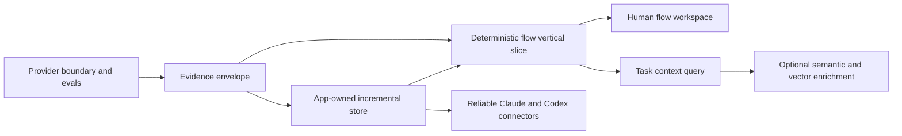

# Product backlog

Status: proposed and prioritized from the 2026-08-05 audit. This is an outcome backlog, not a commitment to a particular sprint length.

## Ordering rationale

The next phase should make one end-to-end path trustworthy before broadening language coverage, adding more MCP tools, or committing to vector infrastructure. The dependency order is:

## P0 — foundations that prevent rework

### PROV-001: Provider runner and SCIP import spike

Implement the boundary described in
[`PROVIDER_STRATEGY.md`](PROVIDER_STRATEGY.md) before extending the current
TypeScript semantic prototype.

Acceptance criteria:

- Providers declare identity, version, supported capabilities, required inputs,
  and degradation behavior.
- One maintained SCIP indexer can be invoked against an immutable, app-owned
  staged snapshot of this repository. A prebuilt index may also be imported for
  evaluation, but is unverified unless it comes with equivalent provenance.
- The runner records provider identity and version, output digest, and an input
  manifest for the staged snapshot. Only output produced from that immutable
  view, or from equivalently mutation-fenced inputs, can be classified as exact
  for that snapshot; equal live-workspace signatures before and after a run are
  not sufficient.
- A mismatched working tree is reported as stale rather than exact. An arbitrary
  imported index is reported as unverified, not assigned the snapshot observed
  at import time.
- Provider artifacts are written to app-owned or temporary workspace storage,
  not into the indexed source repository.
- Tree-sitter syntax/search remains available when the precise provider is
  absent or fails.
- EVAL-001 compares the provider with the existing reference prototype before
  either is promoted as the product default.
- The implementation does not duplicate TypeScript project or package
  resolution inside SDLC.

Progress (2026-08-10): the app now bundles the maintained SCIP TypeScript
indexer, supervises bounded evaluation runs, decodes and hashes indexes in Rust,
stores manifests outside source repositories, reports capabilities in the
desktop, and preserves Tree-sitter fallback behavior. Rust now copies the exact
indexed source generation into a private app-owned view, rejects a generation
mismatch, records every staged input and hash, verifies that view after the
provider exits, and reports retained output as stale after the source signature
changes. The app does not yet attest package dependencies or other compiler
reads outside that source view, so the evaluation remains partial/unverified
instead of claiming exact provenance. Official SCIP occurrences and
relationships now project through the provider-neutral evidence envelope with
artifact/input-manifest validation, workspace ownership, exact staged-root
binding, portable path confinement, retained case-alias identities, bounded
collection, conflict-safe local-symbol scope, and explicit ambiguity. Broader
golden-corpus comparison and complete dependency/read-closure attestation
remain acceptance-critical next steps. Joern
is detected but intentionally not bundled before its EVAL-001 spike. Configless
evaluation now uses an app-owned config rather than allowing the upstream CLI
to write `tsconfig.json` into the workspace, and Rust comparison aggregates
deduplicate documents emitted by overlapping project configs. Discovery,
execution, and decode waits are cancellable; requested projects that the
upstream tool skips are reported as `partial` rather than a fully successful
evaluation. Discovery covers both TypeScript and JavaScript configs, invalid
configs and oversized-source skips remain visible in partial results, and
flag-like but legal workspace paths cannot be interpreted as provider options.
Preflight is syntax-only, size/time bounded, and leaves solution-config project
references to SCIP instead of synchronously duplicating compiler resolution in
the daemon.

### INT-001: Canonical fact, edge, and provenance contract

Define the common intermediate representation before adding deeper analyzers.

This is a provider-neutral interchange envelope, not a new semantic indexer or
a duplicate compiler dependency graph. Keep it no larger than required to
preserve provider identity, evidence, uncertainty, snapshot, and staleness at
the app boundary.

Required fields include stable identity, workspace, producer, producer version, source anchor, confidence or certainty class, generation, ownership scope, input signature, and timestamps. Define an initial vocabulary for containment, import, reference, call, return, branch, throw/catch, await/resume, register/dispatch, read/write, emit/handle, and terminal-effect relations.

Acceptance criteria:

- Parsed, compiler-resolved, framework-inferred, runtime-observed, human-authored, and LLM-derived facts are distinguishable in storage and query responses.
- Every returned edge can navigate to evidence or state why direct source evidence is unavailable.
- Unknown and ambiguous relations have explicit representations.
- Versioned schema documentation includes compatibility and migration rules.
- Existing symbols/imports/refs and asserted relations can be projected into the contract.

Progress (2026-08-10): schema version 1 now defines the minimum producer,
generation, ownership, certainty, freshness, evidence, endpoint, node, and edge
envelope plus the initial relation vocabulary. The existing files, symbols,
imports, references, and authored relations project into it without replacing
their prototype tables; missing legacy import ranges and unresolved endpoints
remain explicit. Official SCIP occurrences and relationships now project
through the same envelope with durable workspace/run validation. Persisting
provider-run ownership and broader query adoption remain open.

### EVAL-001: Golden corpus and measurement harness

Create small checked-in repositories or fixtures that exercise direct calls, aliases, overloads, callbacks, conditions, exceptions, async work, HTTP registration, events, database effects, and unresolved dynamic behavior. Include expected symbols, relations, entry points, paths, and uncertainty.

Acceptance criteria:

- One command reports symbol/reference/path precision and recall, indexing time, incremental time, peak memory, and store size.
- Retrieval scenarios report recall at K, evidence coverage, packed tokens, and irrelevant-context rate.
- Native and fallback extractors are compared against the same oracle.
- Results are machine-readable and CI fails on agreed correctness regressions.
- Benchmarks clearly separate cold, warm, and one-file-change runs.

Progress (2026-08-11): the first checked-in TypeScript fixture covers a
cross-file call, condition, early return, throw, await, and terminal HTTP
response. `npm run eval` now runs the fallback scanner, native scanner,
native scanner plus TypeScript checker prototype, and SCIP provider in isolated workers; it emits
machine-readable targeted symbol/reference precision and recall, cold/warm/
one-file-change timing where supported, prototype-store/artifact size, worker
peak RSS, missing facts, and threshold failures. CI pins the official SCIP
v0.9.0 binary and reuses its golden-test format and validator rather than
reimplementing occurrence truth. The corpus remains one narrow scenario; path
and retrieval scoring, external-provider child memory, broader fixtures, and
meaningful promotion thresholds are still open. See
[`EVALUATION.md`](EVALUATION.md).

### STORE-001: Move workspace state under app ownership

Replace in-repository, whole-export `sql.js` persistence with a native SQLite owner behind the local engine. Define workspace IDs, store locations, migrations, backups, corruption recovery, and repository relocation behavior.

Acceptance criteria:

- Indexing does not write generated state into the source repository.
- Transactions update changed facts without exporting the entire database.
- A workspace can move or be re-opened without silently duplicating or losing knowledge.
- The daemon handles schema migration and failed migration recovery.
- FTS5 is enabled and queried through an internal search interface.
- Existing prototype stores have either a tested migration or a clearly documented disposable reset path.

### INCR-001: Ownership and dependency-directed invalidation

Implement a signature hierarchy and a dependency table for derived artifacts.

Acceptance criteria:

- File, syntax, symbol-interface, symbol-body, relation-set, flow, component, prompt/model, and semantic-result signatures can be recorded where applicable.
- A comment-only change does not automatically invalidate unrelated semantic and flow artifacts.
- A public symbol change invalidates known callers and dependent summaries.
- The application can explain why an item is fresh or stale.
- Deleted, renamed, and moved files do not leave orphan facts.
- Native and fallback scanners share an explicit, tested source-inclusion
  policy. Generated builds, packaged app copies, and app-owned artifacts cannot
  enter trusted facts through either a full scan or a watch refresh, and the UI
  can explain why a path was included or excluded.

Observed during the 2026-08-06 desktop walkthrough: creating the packaged app
under `release/` caused its bundled `preload.cjs` to enter the live inventory and
immediately appear as an unexplained, drifting map file. Resolve this as an
input-boundary rule, not as a one-off special case for this repository.

## P1 — first differentiated product slice

### FLOW-001: TypeScript entry-to-effect flow MVP

Dogfood the engine on this repository. Recognize daemon HTTP routes and CLI/MCP handlers as entries, then trace calls and branches to responses, database mutations, process execution, filesystem operations, and outbound requests as terminal effects.

This is a progressive static analysis, not a claim of complete path feasibility.
Evaluate Joern/CPG output against EVAL-001 first, then add only the translation
and product-specific framework adapters needed for the vertical slice. Do not
build a universal TypeScript control/data-flow engine or rely on undocumented
TypeScript compiler internals as the only representation.

Acceptance criteria:

- At least three real flows in this repository can be queried from a named entry to all recognized terminal effects.
- `if`/switch/loop, early return, throw/catch, and `await` transitions are visible and labeled.
- Each node/edge includes evidence and provenance; unresolved dispatch is shown as a gap.
- Cycles and recursion terminate safely and are represented without infinite expansion.
- Expected paths in the golden corpus pass precision/recall thresholds set by EVAL-001.
- Asserted relations can be enabled as a clearly labeled overlay in path queries.

### UI-001: Question-centered code and flow workspace

Turn the desktop from an operational viewer into a daily-use exploration surface.

Acceptance criteria:

- A global search box finds paths, symbols, exact text, components, flows, findings, and memories.
- Selecting a result opens source at the relevant range with definition/reference and caller/callee navigation.
- A user can choose an entry point, inspect alternate branches and terminal effects, and see provenance, uncertainty, and freshness without reading raw JSON.
- Source, path, and neighborhood views synchronize selections.
- Large graphs default to focused neighborhoods and expansion, not an unreadable whole-repository canvas.
- The workflow remains fully useful with semantic enrichment disabled.

### QUERY-001: One budgeted task-context query

Add an internal query planner and expose one primary agent operation such as `get_task_context`. It should compose lexical search, graph neighborhoods, flow paths, source ranges, tests, changes, findings, and approved memories.

Acceptance criteria:

- Inputs include the task, optional known targets, intent, and a token/byte budget.
- Results contain a ranked evidence package, omissions, uncertainty, freshness, and recommended follow-up reads.
- Every excerpt or conclusion has a navigable source/fact reference.
- It beats an Aider-style symbol-map baseline on agreed EVAL-001 scenarios or remains an experimental internal path.
- The public MCP catalog is reviewed for redundant tools after this query is proven.

### SEARCH-001: Lexical, structural, and graph-ranked retrieval

Build a strong non-vector baseline using FTS5, identifier-aware scoring, path and language filters, current structural search, and graph centrality/proximity.

Acceptance criteria:

- Exact identifiers, filenames, error strings, phrases, prefixes, and natural-language descriptions have tests.
- Ranking explains whether a result came from lexical match, graph proximity, flow membership, change relevance, or memory.
- Search refresh is incremental.
- Saved queries can be re-run against later index generations for desktop insights.

### CONN-001: Idempotent Claude and Codex connector manager

Introduce a connector interface with plan, apply, verify, repair, update, and remove operations. Package a Codex companion plugin in addition to the existing Claude plugin.

Acceptance criteria:

- The app detects compatible Claude/Codex CLI and desktop surfaces separately.
- It displays exact proposed changes and requires appropriate consent.
- It uses supported marketplace/plugin/MCP commands or APIs where available instead of blind config splicing.
- Installation includes the companion plugin/skills/commands and MCP connection, not MCP alone.
- Verification performs discovery plus a local engine health/tool call.
- Re-running is idempotent; repair and uninstall only change app-owned entries.
- Compatibility failures provide an actionable diagnosis and never leave a half-configured integration without rollback guidance.

## P2 — compound the value

### SEM-001: Evidence-backed semantic components and workflows

Generate component responsibilities, domain concepts, and human-readable workflows from deterministic subgraphs. Store prompts, model/version, inputs, outputs, evidence links, and approval state.

Acceptance criteria:

- Semantic artifacts can be proposed, edited, approved, rejected, and regenerated selectively.
- A changed dependency marks the artifact stale without deleting the last approved version.
- The UI shows deterministic facts and semantic interpretation as separate layers.
- Generation is cached by normalized input/model/prompt signature and has a configurable local or remote provider policy.
- Interrupted generation remains explicitly partial, can resume without
  discarding valid work, and cannot be presented as a complete map until its
  coverage/finalization contract succeeds.

Progress (2026-08-06): the Claude map runner now eagerly loads only the
allowlisted SDLC MCP tools even when built-in tools are disabled. A previously
interrupted 75% map resumed to 98% coverage, and maintenance refreshed six
drifted components without rebuilding clean work. Finalization rejects stale
retained components or flows, and the supervisor distinguishes initial drawing
from maintenance completion. Editing/approval, fine-grained dependency
invalidation, cancellation UX, and repeatable product evaluation remain open.

### MEM-001: Trustworthy project memory

Evolve notes into a knowledge workflow for gotchas, standards, preferences, decisions, and operational facts.

Acceptance criteria:

- Memories support authorship, evidence, anchors at symbol/range/component/flow level, status, supersession, and review dates.
- Users can create, edit, validate, reject, and resolve stale memories in the desktop app.
- Recall combines FTS, graph proximity, task intent, freshness, and approval state.
- Agent-created assertions never silently become approved team facts.

### VEC-001: Evaluated optional semantic retrieval

Only start after SEARCH-001 and QUERY-001 establish baselines. Embed compact units such as symbol summaries, component descriptions, workflows, documentation, and memories rather than arbitrary fixed-size source chunks by default.

Acceptance criteria:

- Embeddings are derived, versioned, disposable, and excluded from the authoritative backup contract.
- Hybrid ranking has a documented fusion method and optional reranking.
- It materially improves named evaluation scenarios at an acceptable indexing-time, disk, latency, privacy, and token cost.
- The product works when the vector index or embedding model is unavailable.

### LANG-001: Provider architecture and precise-index imports

Define language capability manifests and add providers based on user demand. Prefer importing SCIP or compiler/language-server facts where reliable, with Tree-sitter syntax fallback.

Acceptance criteria:

- Each provider declares supported fact/edge types and precision levels.
- Mixed-language paths preserve producer and confidence at every boundary.
- Missing providers degrade to searchable syntax rather than making the workspace unusable.
- Provider failures are isolated and diagnosable from the desktop app.

### CHANGE-001: Knowledge diff and architectural insights

Retain selected generations so users can compare symbols, dependencies, flows, effects, and semantic maps across working-tree or commit changes.

Acceptance criteria:

- A user can answer “what behavior and dependencies changed?” rather than only “what lines changed?”
- Saved structural queries show count/history changes.
- Drift views link directly to source and affected derived knowledge.
- Retention and compaction are configurable and bounded.

### RUNTIME-001: Runtime evidence overlay

Import test coverage or opt-in traces to confirm dynamic dispatch and path execution. Runtime facts supplement static facts and never erase unobserved possibilities.

Acceptance criteria:

- Observed calls/effects include run identity, environment, test/request context, and time.
- The UI can distinguish possible, statically resolved, and observed paths.
- Instrumentation is opt-in, bounded, and documents performance and privacy impact.

## P3 — scale and ecosystem

- **XREPO-001:** cross-repository workspaces and version-aware dependency navigation.
- **SDK-001:** stable local query/enrichment SDK for language providers and third-party tools.
- **TEAM-001:** explicit export/import or synchronization of approved semantic knowledge without requiring source/index upload.
- **INSIGHT-001:** dashboards for architectural boundaries, dependency policy, ownership, risk, and longitudinal change.
- **SEC-001:** signed integration bundles, supply-chain policy, least-privilege connector permissions, and auditable local data/provider controls.

## Recommended first implementation sequence

### Slice 1: Trust the facts

Deliver the smallest useful EVAL-001 corpus, the narrow PROV-001 runner/SCIP
spike, and only the minimum INT-001 envelope needed to compare existing and
imported facts honestly. This makes subsequent work measurable without first
rebuilding a compiler indexer.

### Slice 2: Own the state

Deliver STORE-001 plus enough INCR-001 to move this repository’s index out of `sdlc-audit/` and update a single changed file transactionally. Add FTS5 and expose it behind the internal search interface.

### Slice 3: Prove a real flow

Deliver FLOW-001 for one daemon route all the way through the UI and MCP query. Use the golden corpus and this repository as dual fixtures. This is the first differentiated demonstration of the product vision.

### Slice 4: Make it a product

Deliver the focused portion of UI-001 needed to search, inspect, and correct that flow, then implement CONN-001 so both Claude and Codex can consume it through thin, supported integrations.

## Explicitly deferred

Until the first four slices are measured and usable, defer:

- a standalone graph database;
- a production vector database or repository-wide embedding pass;
- autonomous memory promotion;
- many additional MCP tools;
- broad language count as a vanity metric;
- cloud collaboration infrastructure;
- full CodeQL/Joern-style data-flow and security-query breadth.

These may become valuable. Deferral protects the evidence model and core user workflow from being buried under infrastructure.

## Deferred checkpoint findings

These issues were reproduced during the architecture checkpoint review but do
not currently threaten stored knowledge, answer correctness, a supported
end-to-end workflow, or the local security boundary:

- Add bounded idle expiry for stateful HTTP MCP sessions. Normal bridge exit
  closes its stream without sending the optional session-termination request,
  so the daemon retains a small session object until restart.
- Collapse strongly connected call components, or otherwise prevent cycles
  from inflating presentation depth in the layered flow view. Traversal is
  already depth- and node-bounded; this is a layout-quality issue.
