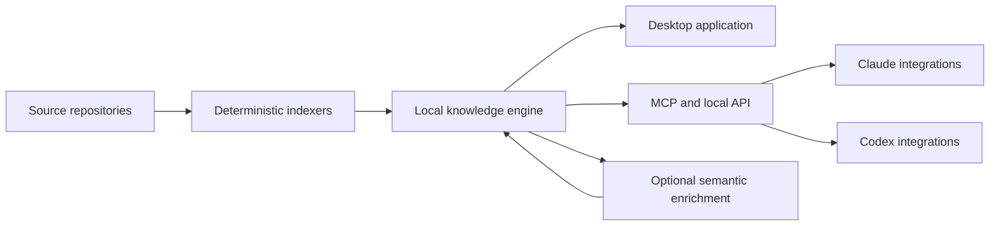

# Product vision

Status: working product direction, captured 2026-08-05.

## One-sentence definition

SDLC is a local-first code-intelligence application that builds an evidence-backed, incrementally maintained model of a software system for both humans and AI tools; Claude and Codex integrations are thin clients of that application, not the place where the intelligence lives.

## The central idea

Trying to ship a sophisticated analyzer as a pile of plugin scripts or as a fragile local MCP process puts the hardest code in the least reliable environment. Users may have different language runtimes, dependencies, permissions, shells, and plugin versions. Large indexes and databases also do not belong inside prompts or disposable tool processes.

The application should instead be a packaged product with a stable local service boundary. It can bring its own Rust binaries, databases, parsers, background workers, MCP servers, migrations, and update mechanism. Integrations installed into Claude Code, Claude Desktop, Codex CLI, and Codex Desktop should mainly provide discovery, commands, skills, and a connection to the local service.

This produces one source of truth and several clients:

The desktop application is not an installer wrapped around an MCP server. It is a first-class way to search, navigate, inspect, correct, and understand a codebase. MCP is one delivery surface for the same intelligence.

## The knowledge pipeline

### 1. Build the deterministic map

The first layer should be reproducible and explainable. It starts with source files, symbols, imports, references, build metadata, and repository structure, then grows into execution-relevant relationships:

- recognized entry points such as commands, HTTP routes, event handlers, jobs, UI interactions, and exported library APIs;
- calls, returns, registrations, dispatches, reads, writes, emissions, subscriptions, and data dependencies;
- branch, loop, error, async, and framework-mediated paths;
- terminal effects such as returning a response, mutating a database, writing a file, making a network request, publishing an event, rendering state, or exiting a process.

The goal is not merely an import graph or a list of tagged files. The engine should answer, with evidence, “how can execution get from this entry point to these effects, and where can it branch?”

Deterministic does not mean pretending every language feature can be resolved statically. Unknown, ambiguous, dynamic, and inferred relationships must be represented explicitly. An incomplete path labeled with its limits is more useful than a confident but invented one.

### 2. Add a semantic layer

LLMs can turn the deterministic evidence into concepts humans use: components, responsibilities, workflows, architectural boundaries, domain language, risks, and summaries. These interpretations should always retain links to their supporting facts and record how they were produced.

Semantic output is derived knowledge, not a replacement for the underlying map. It can be edited or approved by a person, regenerated selectively, and marked stale when its dependencies change.

### 3. Serve focused context

Humans and agents should query the model instead of repeatedly rediscovering the repository from raw files. A request should combine the smallest useful subgraph, relevant source ranges, approved memories, change state, and known uncertainty within an explicit token or display budget.

This is meant to reduce both noise and cost. Reading source remains available and authoritative, but it becomes a deliberate final step rather than the only discovery mechanism.

### 4. Learn without corrupting facts

The system should retain useful knowledge that static analysis cannot derive: conventions, gotchas, architectural decisions, preferred patterns, rejected approaches, and operational notes. Memories need anchors, provenance, lifecycle state, and staleness behavior.

Agent assertions may add missing relationships, but they must live in a distinguishable overlay until verified. Parsed facts, compiler-resolved facts, heuristics, runtime observations, human notes, and LLM interpretations must never become indistinguishable.

## One model, several access patterns

“Relational, graph, and vector data” describes the access patterns the product needs; it does not require three databases.

- Relational facts support constraints, migrations, provenance, filtering, and reliable updates.
- Graph relationships support traversal, impact analysis, path finding, callers/callees, and flow exploration.
- Lexical search supports exact identifiers, error strings, filenames, and precise terminology.
- Vector search may help with fuzzy concepts and natural-language recall.

The preferred starting point is an embedded relational source of truth with explicit edge tables and full-text search. Vector indexes should be optional, versioned derived data added only where evaluation shows that lexical and graph retrieval are insufficient. A separate graph database is not justified merely because the data forms a graph.

## Change detection and selective invalidation

Every expensive result should declare what it depends on. Signatures should form a hierarchy rather than one repository-wide checksum:

1. bytes and file content;
2. syntax tree or normalized syntax;
3. symbol interface and body;
4. reference or relation set;
5. flow or component aggregate;
6. semantic summary, embedding, or memory validation.

When a leaf changes, the engine should invalidate only affected facts and derived artifacts. Moving an unchanged file, editing a comment, changing a private body, and changing a public interface should not all trigger the same work. The application should be able to explain why an artifact is fresh, stale, or being rebuilt.

## The desktop product

The human-facing application should eventually make the following jobs materially easier even when no LLM is connected:

- fast global code and knowledge search;
- definition, reference, caller, callee, and dependency navigation;
- entry-to-effect flow exploration with visible branches and uncertainty;
- source and graph views that stay synchronized;
- impact analysis before a change;
- comparison of maps across commits or working-tree changes;
- review and correction of components, flows, memories, and inferred relationships;
- index health, language coverage, stale knowledge, and integration diagnostics;
- architectural insights and saved queries over time.

The interface should favor answering a question over displaying a hairball graph. Graphs, code, lists, and timelines are complementary views of the same evidence.

## Claude and Codex integration

The application owns compatibility knowledge and provides an idempotent connector workflow:

1. detect supported tools and versions;
2. show the exact changes required;
3. install or update the appropriate plugin, skills, commands, and MCP connection using supported tool interfaces;
4. verify the connection end to end;
5. diagnose drift and repair or remove the integration safely.

Integrations should remain thin. They may contain tool-specific instructions and user experiences, but analysis logic, durable state, migrations, security decisions, and expensive dependencies stay in the application.

## Stable product principles

- Evidence before explanation. Every conclusion should be traceable to source or an explicitly labeled assertion.
- Precise when available, graceful when not. Use compiler-grade indexes where possible and syntax/search fallbacks elsewhere.
- Incomplete is acceptable; silently incorrect is not.
- Base facts and derived knowledge have different ownership and invalidation rules.
- Local-first is the default. Source and indexes should not need to leave the machine for core functionality.
- Retrieval quality is measured. More context is not automatically better context.
- The application is useful without an agent, and agent integrations make it more useful rather than defining it.
- Prefer a small number of strong query primitives over a large, overlapping tool catalog.
- Extend through language providers and enrichment adapters rather than putting every implementation in the core.

## What this is not

- It is not a prompt bundle with a database attached.
- It is not only a dependency visualizer.
- It is not an autonomous code-writing agent.
- It is not a replacement for compilers, tests, debuggers, or source control.
- It is not committed to a graph database or embeddings as product requirements.
- It should not claim complete program understanding when dynamic behavior prevents it.

## North-star experience

A developer opens a repository in the desktop app. The initial useful index appears quickly and improves as precise analyzers finish. They can search for a concept, open a recognized entry point, follow each labeled branch to its terminal effects, inspect the exact supporting code, and see which parts are uncertain or stale.

When they begin a task in Claude or Codex, the integration asks the app for a task-specific context package. It receives the relevant flow, symbols, source ranges, tests, impact neighborhood, and approved memories rather than scanning dozens of files. After the change, only affected knowledge is recomputed, and the desktop app shows what changed in both code and system behavior.

## Success measures

Product decisions should eventually be judged against measurable outcomes:

- time to first useful result and time to precise result;
- incremental indexing latency, CPU, memory, and disk usage;
- reference and path precision/recall on a golden corpus;
- retrieval recall and answer quality at a fixed context budget;
- reduction in files and tokens agents need for representative tasks;
- percentage of displayed claims with navigable evidence;
- integration install/upgrade/repair success rates;
- usefulness of the desktop workflow without an LLM.
